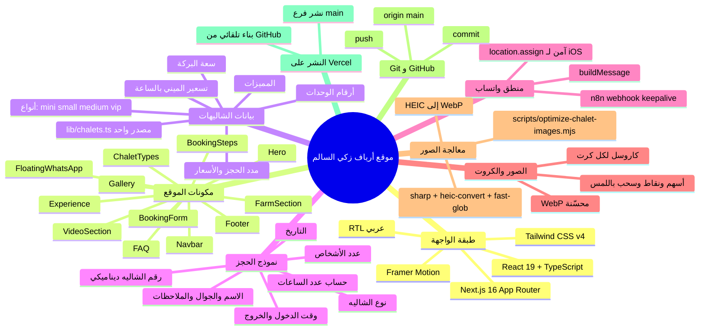
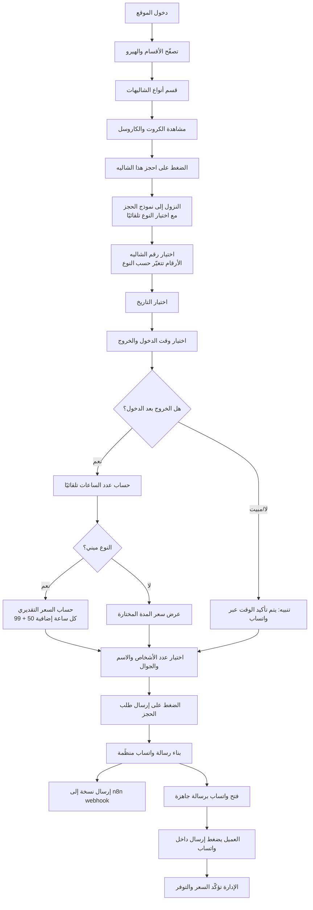

# توثيق مشروع موقع أرياف زكي السالم للمياه الكبريتية

> ملف تعليمي شامل يشرح كيف بُني الموقع، معتمدًا فقط على ملفات المشروع الفعلية.
> تاريخ الإعداد: 2026-06-23.

---

## أولًا: ملخص تنفيذي

**ما هو الموقع؟**
موقع تسويقي وحجز لمنتجع "أرياف زكي السالم للمياه الكبريتية" في الأحساء — شاليهات خاصة مع بِرَك مياه كبريتية طبيعية. مبني بتقنية **Next.js 16** و**React 19** و**TypeScript** و**Tailwind CSS v4**، مع حركات بصرية عبر **Framer Motion**.

**ما وظيفته؟**
يعرض المنتجع وأنواع الشاليهات وأسعارها ومميزاتها، ويتيح للعميل تجهيز طلب حجز كامل ثم إرساله عبر **واتساب** برسالة جاهزة. لا يوجد دفع إلكتروني؛ التأكيد النهائي للسعر والتوفر يتم يدويًا عبر واتساب.

**ما الذي يقدّمه للعميل؟**
- استعراض 4 أنواع شاليهات (ميني / صغير / وسط / قبة مالديفية VIP) بصور حقيقية في كاروسل.
- تفاصيل كل نوع: الأرقام، سعة البركة، دورات المياه، الغرف/المجلس، المميزات، مدد الحجز.
- نموذج حجز ذكي يختار النوع والرقم والوقت ويحسب الساعات ويقدّر سعر الميني.
- زر واتساب عائم وروابط تواصل سريعة.

**لماذا هو منصة حجز وليس مجرد صفحة؟**
لأنه يحتوي منطق تطبيق فعليًا: حقول مترابطة (رقم الشاليه يتغيّر حسب النوع)، حساب تلقائي لعدد الساعات من وقت الدخول/الخروج، تسعير ديناميكي لشاليهات الميني، توليد رسالة واتساب منظّمة من بيانات العميل، وإرسال نسخة من الطلب إلى **n8n webhook** للأرشفة. هذه عمليات منصّة وليست محتوى ثابتًا.

---

## ثانيًا: الخريطة الذهنية (Mermaid mindmap)



---

## ثالثًا: خريطة تدفق رحلة العميل (Mermaid flowchart)



---

## رابعًا: شرح الملفات

| الملف | وظيفته | علاقته بالموقع | النوع |
|---|---|---|---|
| `app/layout.tsx` | الهيكل الجذري، `<html lang="ar" dir="rtl">`، وميتاداتا SEO/OpenGraph | يغلّف كل الصفحات | واجهة/إعدادات |
| `app/page.tsx` | الصفحة الرئيسية: ترتيب كل المكونات + بيانات JSON-LD منظّمة | قلب الموقع | واجهة |
| `app/globals.css` | متغيّرات ألوان Tailwind، الخطوط، أدوات مثل liquid-glass والـgold-divider | التنسيق العام | إعدادات تنسيق |
| `app/robots.ts` / `app/sitemap.ts` | توليد robots.txt وخريطة الموقع | SEO | إعدادات |
| `app/privacy` / `app/terms` / `app/booking-policy` | صفحات قانونية | روابط الفوتر | واجهة |
| `components/Navbar.tsx` | شريط علوي ثابت، قائمة جوال، زر "احجز الآن" ينزل للنموذج | تنقّل | واجهة |
| `components/Hero.tsx` | القسم الافتتاحي: خلفية بباراللاكس، عنوان، أزرار، شريط مميزات | أول انطباع | واجهة |
| `components/Experience.tsx` | بطاقات "لماذا أرياف" (مزايا المنتجع) | محتوى تسويقي | واجهة |
| `components/VideoSection.tsx` | مشغّل فيديو يوتيوب (يحمّل عند الضغط) | عرض التجربة | واجهة |
| `components/Gallery.tsx` | معرض صور بشبكة + لايت بوكس | استعراض المكان | واجهة |
| `components/FarmSection.tsx` | قسم "وجهة عائلية متكاملة" بصور المزرعة | محتوى | واجهة |
| `components/ChaletTypes.tsx` | كروت أنواع الشاليهات + الكاروسل + زر الحجز | جوهر العرض | واجهة |
| `components/BookingSteps.tsx` | شرح خطوات الحجز (4 خطوات) | توضيح | واجهة |
| `components/BookingForm.tsx` | نموذج الحجز كاملًا: الحقول والمنطق ورسالة واتساب | جوهر الحجز | واجهة + منطق |
| `components/FAQ.tsx` | الأسئلة الشائعة (أكورديون) | ثقة العميل | واجهة |
| `components/Footer.tsx` | تذييل: تواصل، روابط، CTA نهائي | ختام | واجهة |
| `components/FloatingWhatsApp.tsx` | زر واتساب عائم يظهر بعد ثوانٍ | تحويل سريع | واجهة |
| `components/icons.tsx` | مكتبة أيقونات SVG داخلية | تُستخدم في كل مكان | واجهة |
| `lib/chalets.ts` | **مصدر بيانات الشاليهات الوحيد** + دوال مساعدة | يغذّي الكروت والنموذج | بيانات |
| `lib/site.ts` | ثوابت: رقم واتساب، روابط، مسارات الصور العامة | إعدادات مركزية | بيانات/إعدادات |
| `scripts/optimize-chalet-images.mjs` | تحويل HEIC إلى WebP وتحسينها + تقرير | تجهيز الصور (يُشغّل يدويًا) | سكربت |
| `package.json` | التبعيات والأوامر (dev/build/start/lint) | تعريف المشروع | إعدادات |
| `next.config.ts` / `tsconfig.json` / `postcss.config.mjs` / `eslint.config.mjs` | إعدادات Next وTypeScript وTailwind وESLint | البناء والجودة | إعدادات |

---

## خامسًا: شرح بيانات الشاليهات (`lib/chalets.ts`)

هذا الملف هو **المصدر الوحيد للحقيقة** — يستورده كرت العرض (`ChaletTypes`) ونموذج الحجز (`BookingForm`) معًا، فلا يحدث تضارب.

**أنواع الشاليهات (4):**

| المعرّف `id` | الاسم | الأرقام | سعة البركة | دورات المياه | الغرف/المجلس |
|---|---|---|---|---|---|
| `mini` | شاليهات ميني | 106 — 113 | 5 أشخاص | دورة مياه | غرفة نوم صغيرة |
| `small` | شاليه صغير | 101 / 102 | 7 أشخاص | دورتين مياه | غرفة نوم + مجلس |
| `medium` | شاليه وسط | 103 / 104 | 7 أشخاص | دورتين مياه | غرفة نوم + مجلس |
| `vip` | قبة مالديفية VIP | 115 / 105 | 10 أشخاص | دورتين مياه | غرفة نوم خاصة + صالة مكيفة |

**الأرقام:** كل نوع له حقل `numbers` (مصفوفة أرقام الوحدات) و`numbersLabel` (نص مختصر للعرض). هذه الأرقام هي ما يظهر في قائمة "رقم الشاليه" داخل النموذج.

**الصور:** حقل `images` لكل نوع — mini/small/medium يشيرون لصور WebP في مجلداتهم (`/image/chalets/<type>/`)، وVIP يشير لمجموعة مختارة من `/image/chalets/maldives-vip/115/`. الكاروسل يتكيّف مع أي عدد صور.

**المميزات:** حقل `features` — قائمة بأهم نقاط كل نوع (تظهر بعلامات ✓ في الكرت).

**مدد الحجز والأسعار:** حقل `periods` (مصفوفة `{label, price}`) للأنواع ذات المدد الثابتة (صغير/وسط/VIP). الميني ليس له `periods` بل يُحتسب بالساعة.

**تسعير الميني:** حقل `hourlyPricing = { firstHour: 99, extraHour: 50 }`، ودالة:
```ts
estimateMiniPrice(hours, pricing) = pricing.firstHour + max(0, hours - 1) * pricing.extraHour
```
أي: أول ساعة 99 ريال، وكل ساعة إضافية 50 ريال (ساعة=99، ساعتان=149، ٣=199، ٤=249).

**دوال مساعدة:** `getChaletById(id)` لجلب نوع، و`estimateMiniPrice(...)` للحساب.

---

## سادسًا: شرح نموذج الحجز (`components/BookingForm.tsx`)

**الحقول بالترتيب:**
1. نوع الشاليه (قائمة من `CHALETS`).
2. رقم الشاليه (قائمة **ديناميكية** = `chalet.numbers`، معطّلة حتى يُختار النوع).
3. التاريخ (منتقي تاريخ).
4. وقت الدخول (`type="time"`، أرقام لاتينية، يفتح بالضغط على كامل الحقل).
5. وقت الخروج (نفس المواصفات).
6. عدد الساعات (للعرض فقط، محسوب تلقائيًا).
7. مدة الحجز (للأنواع الثابتة منسدل بالأسعار؛ للميني ملاحظة أن المدة من الوقتين).
8. عدد الأشخاص (قائمة `chalet.guests`).
9. الاسم.
10. رقم الجوال.
11. ملاحظات.

**وقت الدخول والخروج وحساب عدد الساعات:**
الدالة `computeHours(checkIn, checkOut)` تأخذ صيغة "HH:MM"، تحوّلها لدقائق، وإذا كان الخروج **بعد** الدخول تُرجع عدد الساعات (تقريب لأعلى). إذا كان الخروج ليس بعد الدخول (مبيت يعبر منتصف الليل أو إدخال خاطئ) تُرجع `null`، فيظهر تنبيه: "سيتم تأكيد الوقت والتوفر عبر واتساب".

**تسعير الميني داخل النموذج:**
عند اختيار ميني وتحديد الوقتين، يُحسب `estimatedPrice` عبر `estimateMiniPrice(hours, hourlyPricing)`. لباقي الأنواع، السعر = سعر المدة المختارة من `periods`. يظهر السعر في صندوق "السعر التقديري".

**بناء رسالة واتساب (`buildMessage`):**
تجمّع البيانات في رسالة منظّمة سطرًا سطرًا (تتجاهل الحقول الفارغة): النوع، رقم الشاليه، التاريخ، وقت الدخول، وقت الخروج، عدد الساعات، مدة الحجز، عدد الأشخاص، السعر التقديري، الاسم، الجوال، الملاحظات — وتنتهي بعبارة "يرجى تأكيد السعر والتوفر".

**الإرسال الآمن:**
عند الضغط، يُبنى رابط واتساب أولًا، ثم تُرسل نسخة من الطلب إلى **n8n webhook** بأسلوب fire-and-forget مع `keepalive`، ثم يُفتح واتساب عبر `window.location.assign` بشكل **متزامن** — وهذا يتجاوز حاجب النوافذ في سفاري/iOS.

---

## سابعًا: شرح الصور

**الصور الخام (المصدر):** توضع في `public/image/chalets-raw/<type>/` بصيغة **HEIC** (تصوير الآيفون)، وقد تحمل أسماء عربية ومسافات. لا تُعرض على الموقع ولا تُعدَّل.

**الصور النهائية (الجاهزة للويب):** تُخرَج في `public/image/chalets/<type>/` بصيغة **WebP** بأسماء إنجليزية مرتّبة (`mini-01.webp`, `small-01.webp`, ...).

**كيف يتم التحويل (`scripts/optimize-chalet-images.mjs`):**
يعالج mini/small/medium فقط (لا يلمس maldives-vip). لكل ملف:
1. قراءة HEIC وفك ترميزه إلى JPEG عبر `heic-convert`.
2. تصحيح الاتجاه تلقائيًا (auto-orient) عبر `sharp`.
3. تصغير العرض إلى 1600px كحد أقصى.
4. رفع إضاءة خفيف جدًا (3%) وشحذ خفيف.
5. حفظ بصيغة WebP بجودة 82.
6. إنشاء تقرير `image-optimization-report.md` (الحجم قبل/بعد ونسبة التوفير ونجاح HEIC).

المكتبات المستخدمة (devDependencies): `sharp`، `heic-convert`، `fast-glob`.

**كيف ترتبط الصور بالكروت:**
بعد المعالجة، تُحدَّث مصفوفة `images` لكل نوع في `lib/chalets.ts` بمسارات WebP الجديدة. مكوّن الكاروسل (`ChaletCarousel` داخل `ChaletTypes.tsx`) يقرأ هذه المصفوفة ويعرضها كلها بأسهم ونقاط ودعم السحب باللمس — بلا حد أقصى على عدد الصور.

---

## ثامنًا: شرح النشر

- **Git:** نظام تتبّع نسخ محلي. يسجّل تاريخ التغييرات على جهازك في مستودع (repository).
- **GitHub:** استضافة سحابية للمستودع. مستودع المشروع: `alialteibe-ui/ariaf-website` على الفرع `main`.
- **Vercel:** منصة استضافة ونشر متخصصة في Next.js. تُربط بمستودع GitHub، وعند كل تحديث على `main` تبني الموقع وتنشره تلقائيًا.
- **commit:** "لقطة" محفوظة لمجموعة تغييرات مع رسالة تصفها — تبقى محليّة على جهازك.
- **push:** رفع الـcommits المحلية إلى GitHub (`git push origin main`) لتصبح على السحابة.
- **deploy:** عملية بناء الموقع ونشره ليصبح متاحًا على الإنترنت — تحدث تلقائيًا في Vercel بعد كل push إلى `main`.

**السلسلة الكاملة:** تعديل الكود ← `commit` ← `push` ← Vercel يبني ← الموقع المباشر يتحدّث.

---

## تاسعًا: ماذا لو أردنا بناء موقع مشابه من الصفر؟ (خطة مبسّطة)

1. **جمع البيانات:** أنواع الوحدات، الأرقام، السعات، المميزات، المدد، الأسعار، رقم واتساب — في مكان واحد منظّم.
2. **تصميم الواجهة:** اختيار لوحة ألوان وخطوط ونظام تنسيق (Tailwind)، وتحديد الأقسام (هيرو، عرض، حجز، أسئلة، تذييل) مع دعم RTL.
3. **بناء المكونات:** تقسيم الصفحة إلى مكوّنات React مستقلة (Navbar, Hero, Cards, ...).
4. **بناء نموذج الحجز:** حقول مترابطة، تحقّق، حسابات (الساعات/الأسعار)، وتوليد رسالة واتساب + إرسال webhook.
5. **تجهيز الصور:** تحويل الصور الخام إلى WebP محسّنة، تسمية مرتّبة، ربطها بمصدر البيانات.
6. **اختبار الجوال:** فحص الأبعاد المختلفة (360–430px)، السحب باللمس، عدم التداخل، فتح واتساب على iOS.
7. **النشر:** رفع إلى GitHub، ربط Vercel، نشر تلقائي من `main`.

---

## عاشرًا: مهارات تعلّمناها من المشروع

- بناء موقع **Next.js (App Router) + React + TypeScript** بنية احترافية.
- التنسيق بـ**Tailwind CSS v4** مع دعم **RTL** عربي وتصميم فاخر.
- بناء **مكوّنات قابلة لإعادة الاستخدام** وفصل **البيانات عن العرض** (مصدر واحد للحقيقة).
- بناء **كاروسل صور** يدويًا (أسهم + نقاط + سحب باللمس) بلا مكتبات خارجية.
- بناء **نموذج تفاعلي** بحقول مترابطة وتحقّق وحسابات لحظية.
- **منطق تسعير ديناميكي** (تسعير الميني بالساعة) وحساب الوقت.
- توليد **رسالة واتساب** منظّمة وإرسال **webhook** بشكل غير معطِّل.
- معالجة قيود **iOS/سفاري** (فتح واتساب بشكل متزامن).
- **معالجة الصور برمجيًا**: تحويل HEIC→WebP، تصغير، تحسين، توليد تقرير.
- **تحسين الأداء والجوال**: WebP، أبعاد مناسبة، تصميم متجاوب.
- **سير عمل Git/GitHub**: commit، push، وفهم النشر التلقائي عبر Vercel.
- **التعامل مع أسماء ملفات عربية** ومسافات بأمان في السكربتات.
